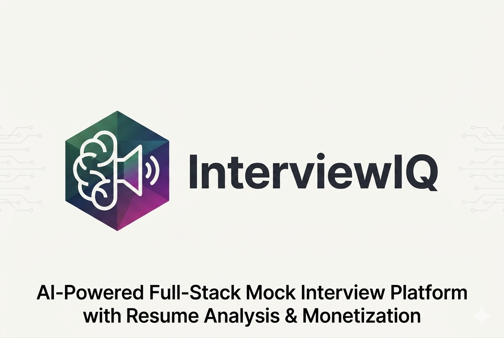

# InterviewIQ 

<!-- ### ✨ Live 
**[Click here to try InterviewIQ Live ](https://ai-interviewer-1-cjug.onrender.com/)** -->

### ✨ Live
<a href="https://ai-interviewer-1-cjug.onrender.com/" target="_blank" rel="noopener noreferrer"><strong>Click here to try InterviewIQ Live</strong></a>




Full-stack AI mock interview platform built with React, Express, MongoDB, Firebase Google Auth, OpenRouter, and Razorpay.

## Project Structure

- `client` - React + Vite frontend
- `server` - Express + MongoDB backend

## Local Development

### Client env

Use `client/.env.example` as the reference:

```env
VITE_FIREBASE_APIKEY=your_firebase_api_key
VITE_SERVER_URL=http://localhost:8080
VITE_RAZORPAY_KEY_ID=your_razorpay_key_id
```

### Server env

Use `server/.env.example` as the reference:

```env
PORT=8080
CLIENT_URL=http://localhost:5173
MONGODB_URL=your_mongodb_connection_string
JWT_SECRET=your_jwt_secret
OPENROUTER_API_KEY=your_openrouter_api_key
RAZORPAY_KEY_ID=your_razorpay_key_id
RAZORPAY_KEY_SECRET=your_razorpay_key_secret
NODE_ENV=development
```

### Run the app

Server:

```bash
cd server
npm install
npm run dev
```

Client:

```bash
cd client
npm install
npm run dev
```

## Deployment Notes

- Deploy `server` and `client` separately.
- Set `CLIENT_URL` on the server to the deployed frontend URL.
- Set `VITE_SERVER_URL` on the client to the deployed backend URL.
- Set `NODE_ENV=production` on the server so auth cookies use production-safe settings.
- Add the deployed frontend domain to Firebase authorized domains.
- Add the deployed frontend and backend domains to Razorpay configuration if required by your account setup.
